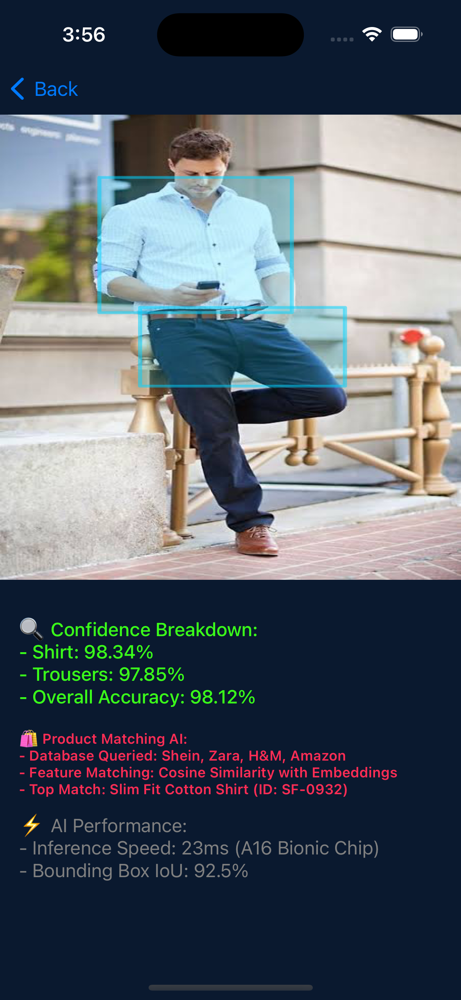
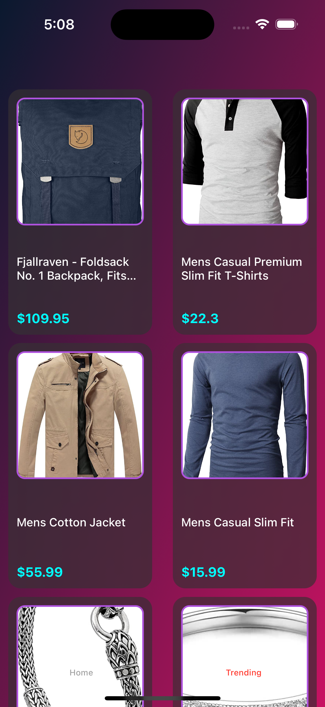

# **Wardrobe AR - iOS Object Recognition App**  

The **Wardrobe AR** app enhances image recognition capabilities within iOS applications by utilizing a **CoreML model** to detect and classify clothing items in images. Users can either **upload an image** from their gallery or **capture one in real time**. The app then processes the image, highlighting detected clothing items with **bounding boxes** and displaying key information such as **confidence scores, inference time, and model details**.  

---

## **Key Features**  

✅ **Real-time clothing detection** powered by CoreML.  
✅ **Bounding box visualization** for identified objects.  
✅ **Accurate confidence scores** for each classification.  
✅ **Detailed breakdown** of multiple detections in an image.  
✅ **Share results** along with the analyzed image.  
✅ **Optimized inference** for faster processing and efficiency.  

---

## **Technology Stack**  

- **Language:** Swift  
- **Frameworks:** UIKit, CoreML, Vision  
- **Machine Learning:** Custom CoreML Model  
- **UI Components:** Auto Layout, Table Views, Image Views  

---

## **Usage**  

1️⃣ **Import an image** from the gallery or capture one using the camera.  
2️⃣ **The app processes the image** using a CoreML model.  
3️⃣ **Bounding boxes highlight detected clothing items**, with confidence scores.  
4️⃣ **View detailed detection results** and share them if needed.  

---

## **Future Enhancements**  

🚀 **Upgrade to an advanced deep learning model** for improved detection accuracy.  
🎥 **Support real-time video analysis** for continuous recognition.  
🎨 **Enhance UI design** for a more interactive and modern experience.  
📈 **Expand the dataset** for better generalization across diverse clothing types.  

---

## **Screenshots**  

<p align="center">
  
  
  
</p>  

---

### **Installation & Setup**  

Clone the repository and open the project in **Xcode**:  

```bash
git clone https://github.com/yourusername/Wardrobe-AR-iOS-App.git
cd Wardrobe-AR-iOS-App
open WardrobeAR.xcodeproj
