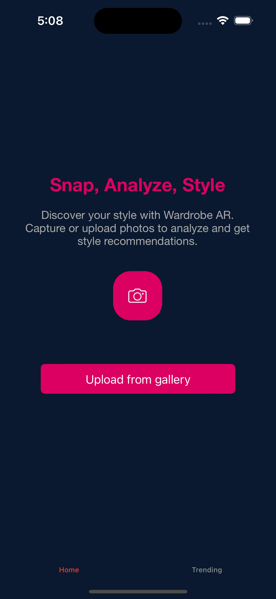

# Wardrobe-AR-iOS-App-Object-Recognition

The Clothing Detection iOS App is designed to enhance image recognition capabilities within mobile applications. It employs a CoreML model for detecting and classifying clothing items in images. Users can select an image from their gallery or capture a new one to analyze. The app highlights detected clothing items with bounding boxes and displays relevant details such as confidence scores, inference time, and model information.

## **Key Features**
- **Real-time clothing detection** using CoreML.  
- **Bounding box visualization** for detected objects.  
- **Confidence scores** for classification accuracy.  
- **Detailed breakdown** of multiple detections.  
- **Share detection results** along with the analyzed image.  
- **Optimized for performance** with efficient model inference.  

## **Technology Stack**
- **Language:** Swift  
- **Frameworks:** UIKit, CoreML, Vision  
- **Machine Learning:** Custom CoreML Model  

## **Usage**
1. **Import an image** from the gallery or capture one using the camera.  
2. **The app processes the image** using a CoreML model.  
3. **Detected clothing items** are displayed with bounding boxes and confidence scores.  
4. **Users can view detailed detection results** and share them if needed.  

## **Future Enhancements**
- **Integration of a more advanced deep learning model** for improved accuracy.  
- **Support for real-time video analysis.**  
- **Enhancement of the UI** for a more interactive experience.  
- **Expansion of the dataset** for better model generalization.  

